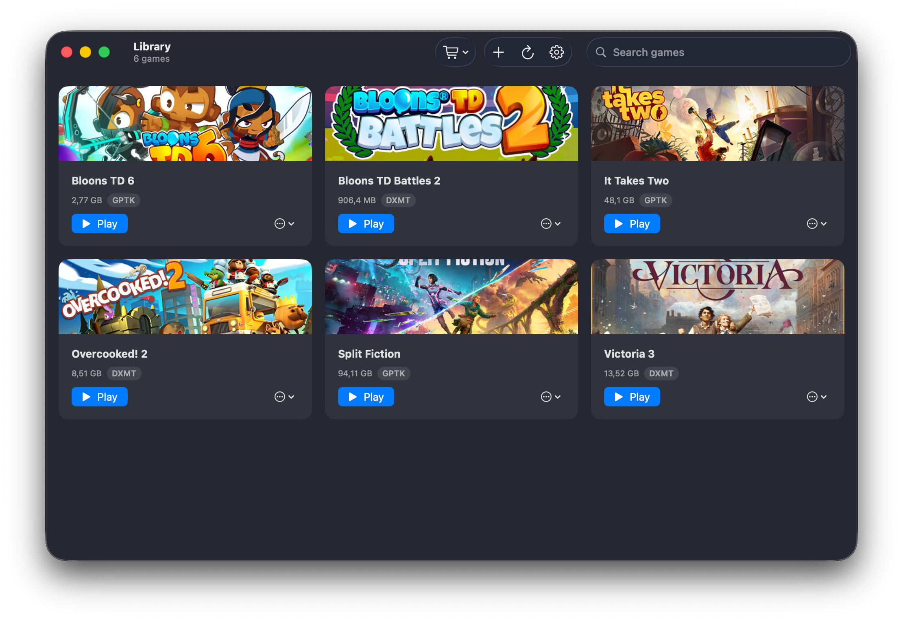

<div align="center">

# Silo

**A fast, native way to run Windows Steam games on Apple-silicon Macs.**

100% SwiftUI · Apple GPTK4/D3DMetal + DXMT graphics

[](https://github.com/mikaelhug/Silo/releases)


[](LICENSE)

[Website](https://mikaelhug.github.io/Silo/) ·
[Releases](https://github.com/mikaelhug/Silo/releases) ·
[Architecture](CLAUDE.md) ·
[Wine build](WINE-BUILD.md) ·
[Status](STATUS.md) ·
[Discord](https://discord.gg/kNysBA9VU5)



</div>

Silo stands up a real **Windows Steam client inside a Wine bottle**, and launches your games
**co-resident with it** on a Metal graphics backend — Apple's D3DMetal, or DXMT for titles it can't
run — so Steamworks and Steam DRM just work, no emulator, no fakery. It downloads its own Wine,
imports Apple's Game Porting Toolkit from your `.dmg`, and self-updates from GitHub Releases.

## Highlights

- **Real Steam, real DRM.** Steamworks IPC is prefix-scoped, so Silo runs each game in the same
  bottle as a logged-in Windows Steam client — auth tickets, ownership, and online features intact.
  Sign in once; Steam caches the login.
- **Two graphics backends.** **GPTK / D3DMetal** (Apple's D3D10/11/12 → Metal layer) drives the Steam
  bottle; **DXMT** (a direct D3D10/11 → Metal layer) is the optional fallback for older titles GPTK
  can't run — selectable per manual game, each in its own isolated bottle.
- **Non-Steam games too.** Add any `.exe` (or run its installer); each manual game lives in its
  **own isolated Wine prefix** with per-game backend, env flags, and launch options.
- **Self-contained.** No Homebrew, no external dependencies: Wine comes from Silo's Releases
  (SHA-256 verified, fail-closed), GPTK from your Apple-downloaded `.dmg`, updates in-app.
- **Native and event-driven.** SwiftUI + Swift 6 strict concurrency; zero polling — game exits,
  Steam readiness, and log tailing are all kqueue-driven. Bottles are relocatable to an external
  drive (with a progress bar; exFAT refused).
- **Guardrails everywhere.** A silent GPTK→wined3d fallback is detected and surfaced instead of a
  black window; a corrupt `config.json` restores from its automatic backup; a bottles move or
  self-update is refused while a game or Steam client is live (and won't run over a process orphaned
  by a prior crash); launch logs open with the fully resolved environment.

## How it works

1. **Bottle** — provision a shared Wine prefix per backend, silently install Windows Steam into it,
   and launch it with the CEF flags that make its UI actually paint under Wine.
2. **Discovery** — parse the bottle's `appmanifest_*.acf` (+ `libraryfolders.vdf`) into typed games;
   each Steam game's backend *is* the bottle it was found in.
3. **Graphics overlay** — inject the backend's modules into the Wine **runtime**'s own `lib/wine`
   tree (GPTK in place; DXMT on an APFS clone of the runtime), forced builtin at launch so nothing
   can shadow them. Idempotent, self-repairing.
4. **Launch** — resolve `(game, backend) → {prefix, runtime}` through one deterministic dispatch
   point and spawn the game co-resident with its Steam client, streaming to a per-game log.

Silo builds, tests, and browses a library with **zero runtimes installed** — everything
runtime-dependent degrades to a guided setup state, never a crash.

## First-run setup

The Library shows a guided setup until the pieces are in place:

1. **Install Wine** — one click; downloads the latest Wine build (~250 MB) from
   [Releases](https://github.com/mikaelhug/Silo/releases).
2. **Import GPTK** — pick Apple's Game Porting Toolkit `.dmg`
   ([developer.apple.com/games](https://developer.apple.com/games/game-porting-toolkit/), free
   Apple ID required); Silo mounts it and extracts the D3DMetal layer.
3. **Set up the Steam bottle** — installs Windows Steam; launch it and sign in once.
4. *(Optional)* **DXMT** — download the DXMT runtime and set up its own Steam bottle for older
   DX10/11 titles.

Then hit **Play**. Per-game settings cover the executable, performance flags (msync, Metal HUD,
MetalFX, raytracing), and launch options; Settings (⌘,) manages Wine/GPTK/DXMT versions, bottle
tools (Retina mode, winecfg/regedit), bottle location, and updates.

> **Gatekeeper:** the app is ad-hoc signed, so a downloaded build is quarantined until you
> right-click → Open (or `xattr -dr com.apple.quarantine Silo.app`).

## Build from source

Requires a Swift 6 toolchain — **Command Line Tools are sufficient, no Xcode needed**.

```sh
swift build              # compile
./Scripts/test.sh        # test suite — passes with no Wine/GPTK/Steam installed
./Scripts/build-app.sh   # assemble + ad-hoc sign dist/Silo.app
./Scripts/run.sh         # build the app and open it
./Scripts/dev.sh         # fast iteration: swift run silo
```

`Scripts/test.sh` wraps `swift test` with the Swift Testing search path Command Line Tools needs
(plain `swift test` fails with "no such module 'Testing'" without Xcode).

### Local Wine without GitHub

Pushing only powers the CI Wine build. To exercise the whole app locally:

```sh
./Scripts/build-wine.sh 26.2.0                # ~30–60 min, from CrossOver source
./Scripts/install-local-wine.sh .wine-build/install wine-cx-26.2.0
```

Then in the app: Settings → **Wine** → Set default, **GPTK** → import your `.dmg`, and the
Library onboarding's **Set up Steam bottle** runs everything else locally. Building DXMT
additionally needs full Xcode's Metal toolchain — see `Scripts/build-dxmt.sh`.

CI runs build + test on every push; tagging `v*` publishes an ad-hoc-signed `Silo.zip` (with its
`.sha256`) via `release.yml`. Every version number lives in one file, `versions.env`.

## Wine sourcing

Silo's Wine is compiled **from CrossOver's open (LGPL) sources in Silo's own CI** and published to
its Releases — no third-party prebuilt dependency, reproducible from `versions.env`. DXMT is built
from its upstream (`3Shain/dxmt`), pinned in `versions.env`, against that same Wine. Apple's D3DMetal
is imported from the user's GPTK `.dmg` (Apple-login-gated, so it is never auto-downloaded). See
[WINE-BUILD.md](WINE-BUILD.md).

## Sandboxing

Silo is **not** App-Sandboxed (see `Resources/silo.entitlements`): it executes `wine` outside its
bundle and reads/writes `~/Library/Application Support` and the bottles, which the sandbox forbids.
User-chosen paths go through the system file picker (powerbox) to avoid TCC denials.

## Legal

Silo is licensed under the [LGPL-2.1-or-later](LICENSE). Wine is redistributed under the same
license from CrossOver's published sources; GPTK stays your own Apple-licensed download. Silo never
bundles or auto-downloads a Steam-API emulator — games talk to the real Steam client you sign into,
in your own account. You are responsible for compliance with Steam's Subscriber Agreement and
applicable law.
